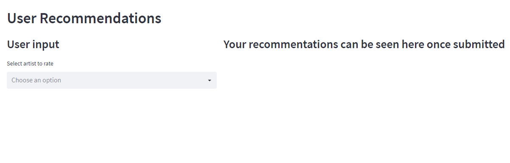
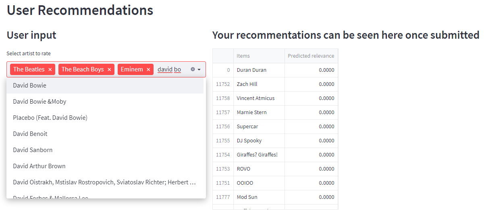
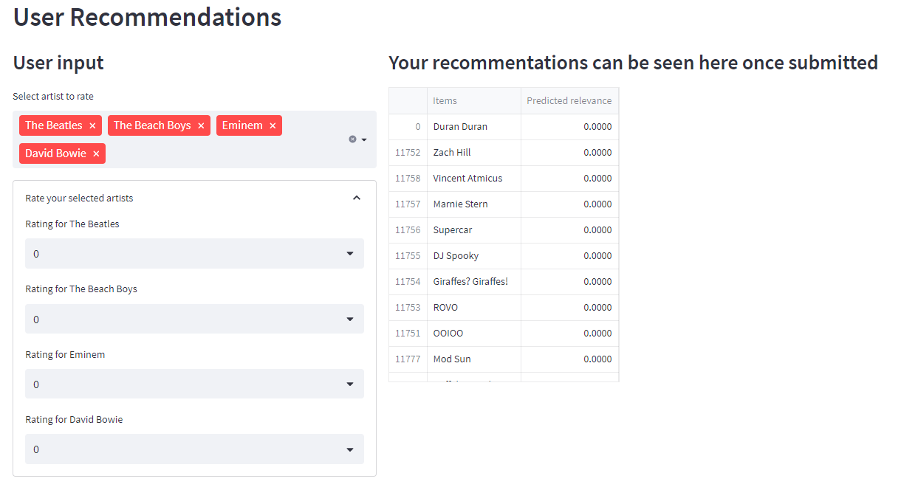
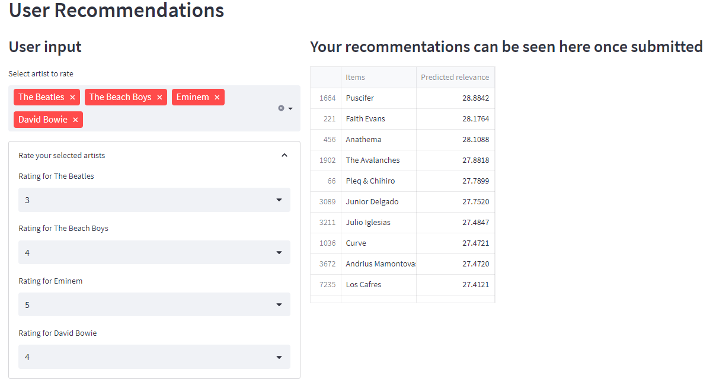

# CA4015-LastFM-Recommender

This repo is for my Advanced Machine Learning assignment on recommender systems. The models were traing using the data from the LastFM dataset available on [grouplens.org](https://grouplens.org/datasets/hetrec-2011/).

The repo contains the [notebook](CA4015-Recommender-System.ipynb) used for analysing the data and creating the recommender systems.

___

### Creating recommendations for new users

Due to the cold-start problem for matrix factorization systems, creating recommendations for new users involves some estiamtion. This can be done by creating an approximate latent representation of the user using ratings provided after the model is trained. This latent representation can then be used as normal to compile a list of items to recommend to the new user.

I have made use of Streamlit to create a UI for entering ratings and computing recommendations. I will show the process of interating with this below.

The user is asked to select one or more artists that they would like to rate, note that the ratings should follow the same format as when training the model. In this case I split the implicit information in user listens into several ordinal values.

+ 0 - A user has not listened to an artist
+ 1 - A user has listened to an artist once
+ 2 - A user has listened to an artist 2-1000 times
+ 3 - A user has listened to an artist 1001-10000 times
+ 4 - A user has listened to an artist 10001-50000 times
+ 5 - A user has listened to an artist 50000+ times

The user can click on the multi-select box and pick one or more artists. They can enter text to search for artists they are looking for.

Next, the user opens the ratings expander and selects a rating value for each artist following the criteria mentioned previously.

The recommendations can be seen in a grid on the right side of the screen. These are updated dynamically whenever the input is changed and can be seen once the first artist has been selected as it is computed with a ratings of 0 for that artist.

The predictions are only adequate as the user representation is appoxiamte and the system could use a more data rich range of inputs to better inform the recommendations.
